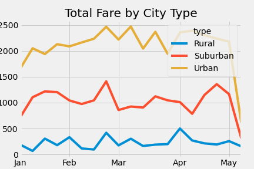

# PyBer_Analysis
## OVERVIEW
This analysis is to determine average fares per driver and plot the trends between January and April 2019

## Results
As expected, the urban ridership is the highest, followed by suburban and rural. Urban fares peak at around $2500 in February and March, while suburban is near $1500 and rural is in the $500 range. The figure below represents the results.

### Summary
It is important to realize that there is a large gap in fares between urban, suburban and rural ridership. This is directly due to the fact that urban populations are generally much higher than suburuban and rural populations. In order to encourage higher numbers among urban and rural riders, one may consider lowering the prices in those regions.